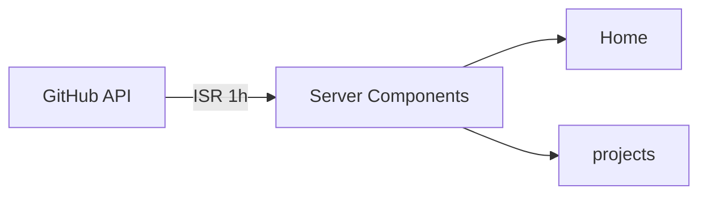

# 🚀 Portfolio

### Portfólio pessoal desenvolvido com Next.js

Apresentando projetos, experiências e habilidades como desenvolvedor Full-Stack

**[🌐 Ver Portfolio ao Vivo →](https://www.andersonkaiti.com)**

## 📋 Sobre

Portfólio moderno e responsivo que consome a API do GitHub para exibir dinamicamente meus repositórios. Inclui:

- Apresentação pessoal e links sociais
- Stack de tecnologias
- Projetos do GitHub
- Experiências profissionais
- Formação acadêmica

---

## 🏗️ Arquitetura

---

## 🛠️ Tecnologias

| Categoria | Tecnologia | Versão | Descrição |
| ----------- | ----------- | -------- | ----------- |
| **Core** | [Next.js](https://nextjs.org/) | 16.1.1 | Framework React com SSR e ISR |
| | [React](https://react.dev/) | 19.2.3 | Biblioteca para construção de interfaces |
| | [TypeScript](https://www.typescriptlang.org/) | 5 | Superset tipado do JavaScript |
| **Estilização** | [TailwindCSS](https://tailwindcss.com/) | 4 | Framework CSS utility-first |
| | [Tailwind Typography](https://github.com/tailwindlabs/tailwindcss-typography) | 0.5.19 | Plugin para tipografia |
| | [tw-animate-css](https://www.npmjs.com/package/tw-animate-css) | 1.3.5 | Animações CSS para Tailwind |
| **UI & Animações** | [Radix UI](https://www.radix-ui.com/) | 1.x | Componentes primitivos acessíveis |
| | [Motion](https://motion.dev/) | 12.23.24 | Biblioteca de animações para React |
| | [cmdk](https://cmdk.paco.me/) | 1.1.1 | Componente de command palette |
| **Data & Estado** | [Zod](https://zod.dev/) | 4.0.5 | Validação de schemas TypeScript-first |
| | [nuqs](https://nuqs.47ng.com/) | 2.8.9 | Gerenciamento de estado via URL |
| | [qss](https://github.com/lukeed/qss) | 3.0.0 | Serialização de query strings |
| | [DayJS](https://day.js.org/) | 1.11.13 | Manipulação de datas |
| **Utilities** | [CVA](https://cva.style/) | 0.7.1 | Gerenciamento de variantes CSS |
| | [clsx](https://github.com/lukeed/clsx) | 2.1.1 | Combinação de classes CSS |
| | [tailwind-merge](https://github.com/dcastil/tailwind-merge) | 3.3.1 | Merge inteligente de classes Tailwind |
| | [Lucide React](https://lucide.dev/) | 0.525.0 | Biblioteca de ícones |
| | [Tabler Icons](https://tabler.io/icons) | 3.34.0 | Biblioteca de ícones |
| | [next-themes](https://github.com/pacocoursey/next-themes) | 0.4.6 | Gerenciamento de temas |
| | [react-markdown](https://github.com/remarkjs/react-markdown) | 10.1.0 | Renderização de markdown |
| | [react-github-calendar](https://github.com/grubersjoe/react-github-calendar) | 5.0.4 | Gráfico de contribuições do GitHub |
| **DevTools** | [Biome](https://biomejs.dev/) | 2.3.11 | Linter e formatador rápido |
| | [@t3-oss/env-nextjs](https://env.t3.gg/) | 0.13.8 | Validação de variáveis de ambiente |
| | [React Compiler](https://react.dev/learn/react-compiler) | 1.0.0 | Compilador experimental do React |
| **Analytics** | [@vercel/analytics](https://vercel.com/analytics) | 1.6.1 | Analytics de produção |
| | [@vercel/speed-insights](https://vercel.com/docs/speed-insights) | 1.3.1 | Métricas de performance |

---

## ✨ Features

- Responsive design com dark mode
- Smooth scroll e animações elegantes
- Projetos dinâmicos da API do GitHub
- Gráfico de contribuições do GitHub
- ISR com revalidação a cada hora
- Type-safe com TypeScript
- Componentes acessíveis
- SEO otimizado
- Analytics e métricas de performance

💙 **Feito com carinho e muito café** ☕

_Obrigado por visitar meu portfólio!_

